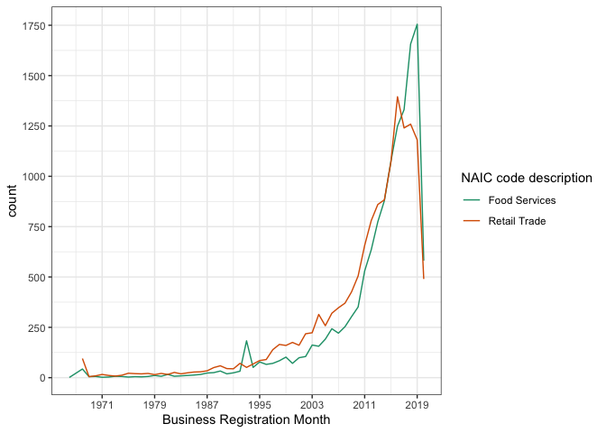

A good friend of mine is in the public health sector focusing on food and nutrition policy, specifically focusing on access and equity for farmer's markets.  I've learned a lot from her around the patterns and trends associated with farmer's markets in California.  There's a normative aspect to her work: a belief that localizing supply chains and connecting farmers directly with consumers is going to be a key go forward strategy for both environmentalism _and_ food access. One of her research programs right now is focused on understanding the barriers discouraging Black communities from patronizing these markets to the same levels that other communities in California do.  There's the obvious factor of price; yet it doesn't fully explain the consumption patterns as there are definitely lower price point markets that working class immigrant enclaves heavily rely on.  In addition to price then, maybe there's a secondary factor of proximity.  Regardless, it seems like wrapped up in this is just larger questions around food access for poor Black communities in America, a topic that I'm not even close to understanding enough to be able to have a proper discussion about.  

As part of building out my general knowledge there, I've been reading some papers around the discriminatory aspects of food access in America.  In parallel, I decided to take a look at the data itself, specifically San Francisco.  Fortunately, the SF City Government has open sourced a lot of interesting datasets, with one being a collection of **all** registered business in the city (including grocery stores and markets!).  Below, I document my efforts in exploring this dataset and understanding a bit more about the trends of food and grocery retail in San Francisco.

Pretty much my default package list for any analysis leveraging public data.  (If I'm querying a database for work, I'll be looking more towards database clients such as `RPostgresql`)

```r
library(tidyr)
library(dplyr)
library(ggplot2)
library(lubridate)
library(scales)
library(httr)
library(jsonlite)
library(readr)
library(purrr)
library(RColorBrewer)
library(scales)

# https://data.sfgov.org/Economy-and-Community/Registered-Business-Locations-San-Francisco/g8m3-pdis
```

The SF gov has a nicely maintained public API for accessing datasets.  You can also just download a csv and read it in manually, but I thought I'd be fancy for reproducibility purposes!  A few nuances regarding access patterns:

- there's a 50000 record limit with one request, which means we have to paginate using an offset parameter
- we get back lat/long coordinates as individual elements in a list; when `jsonlite` parses the .json, it stores these values as a nested dataframe column within the larger dataframe
- there's some weird empty records that we have to catch

```r
# check how many total records so we can back into the number of requests we have to make
records <- fromJSON(content(GET("https://data.sfgov.org/resource/g8m3-pdis.json?$select=count(ttxid)"), as="text"))[1,1]
total_pages <- ceiling(as.integer(records)/50000)

endpoint <- "https://data.sfgov.org/resource/g8m3-pdis.json"

# loop through the number of requests
for (i in seq(c(1:total_pages))) {
  # logic with offset is pretty straightforward; on page 1 the offset is 0, for page 2 we want our offset to start us at 50,001
  url <- paste0(endpoint, "?$limit=50000&$offset=", format((i-1)*50000, scientific = FALSE), "&$order=ttxid")
  print(url)
  df_temp <- fromJSON(content(GET(url, add_headers(`X-App-Token` = "AQrzpwEVnUYlmA22uZxnaqiVY")), as = "text"))
  
  if ("location" %in% colnames(df_temp)) {
    # there's a nested df called location within our parsed dataframe; one of the columns is a nested list-wise column called coordinates, contain lat/long as individual elements within a list
    location_df <- 
      df_temp$location %>%
      mutate(
        lat = map_dbl(coordinates, function(x) {if (is.null(x[1])) {as.double(NA)} else {x[1]}}),
        long = map_dbl(coordinates, function(x) {if (is.null(x[2])) {as.double(NA)} else {x[2]}})
      ) %>%
      select(-coordinates)
  
    df_temp <- cbind.data.frame(df_temp %>% select(-location), location_df)
  } else {
    df_temp <- df_temp %>% mutate(lat = as.double(NA), long = as.double(NA), type = as.character(NA))  
  }
  
  # bind everything together
  if (exists("business_df")) {
    business_df <- rbind.data.frame(business_df, df_temp)
  } else {
    business_df <- df_temp
  }
}

rm(df_temp)
rm(location_df)

# save the rds so we don't have to rerun this everytime
business_df %>% saveRDS("sf_business_data.rds")
```

Some data cleaning (timestamps mostly)...

```r
business_df <- readRDS("sf_business_data.rds")

# for timestamps, remove the T and everything after the '.' inclusive
business_df <- business_df %>%
  mutate(
    dba_start_date = as.POSIXct(gsub("\\..*$", "", gsub("T", " ", dba_start_date))),
    location_start_date = as.POSIXct(gsub("\\..*$", "", gsub("T", " ", location_start_date))),
    location_end_date = as.POSIXct(gsub("\\..*$", "", gsub("T", " ", location_end_date))),
    dba_end_date = as.POSIXct(gsub("\\..*$", "", gsub("T", " ", dba_end_date))),
    supervisor_district = as.integer(supervisor_district)
  )
```

Really basic `Get to Know Your Data`. Looks like Food Services and Retail Trade are the NAIC codes we want for groceries.  There's a _lot_ of business without a code; I did some quick checks and I don't think there are any groceries in there, mostly apartments and things like that.  One thing to note is that multiple businesses can be registered at the same address.  For example, there's a market in Laurel Heights that's one record, but inside that market is a butcher store, coffee shop, cheese shop, etc. that all registered as separate businesses within same address.  The "primary" market has a `Food Services` NAIC code, but all the secondary businesses have an `NA` code.

```r
business_df %>% 
  group_by(naic_code_description) %>%
  count()
```

<div data-pagedtable="false">
  <script data-pagedtable-source type="application/json">
{"columns":[{"label":["naic_code_description"],"name":[1],"type":["chr"],"align":["left"]},{"label":["n"],"name":[2],"type":["int"],"align":["right"]}],"data":[{"1":"Accommodations","2":"8180"},{"1":"Administrative and Support Services","2":"4228"},{"1":"Arts, Entertainment, and Recreation","2":"8316"},{"1":"Certain Services","2":"4494"},{"1":"Construction","2":"18268"},{"1":"Financial Services","2":"5259"},{"1":"Food Services","2":"13593"},{"1":"Information","2":"4989"},{"1":"Insurance","2":"869"},{"1":"Manufacturing","2":"2429"},{"1":"Multiple","2":"5447"},{"1":"Private Education and Health Services","2":"8564"},{"1":"Professional, Scientific, and Technical Services","2":"27547"},{"1":"Real Estate and Rental and Leasing Services","2":"26275"},{"1":"Retail Trade","2":"14610"},{"1":"Transportation and Warehousing","2":"6700"},{"1":"Utilities","2":"359"},{"1":"Wholesale Trade","2":"3893"},{"1":"NA","2":"96203"}],"options":{"columns":{"min":{},"max":[10]},"rows":{"min":[10],"max":[10]},"pages":{}}}
  </script>
</div>

```r
business_df %>% 
  filter(
    is.na(naic_code_description)
  ) %>% 
  head
```

<div data-pagedtable="false">
  <script data-pagedtable-source type="application/json">
{"columns":[{"label":[""],"name":["_rn_"],"type":[""],"align":["left"]},{"label":["ttxid"],"name":[1],"type":["chr"],"align":["left"]},{"label":["certificate_number"],"name":[2],"type":["chr"],"align":["left"]},{"label":["ownership_name"],"name":[3],"type":["chr"],"align":["left"]},{"label":["dba_name"],"name":[4],"type":["chr"],"align":["left"]},{"label":["full_business_address"],"name":[5],"type":["chr"],"align":["left"]},{"label":["city"],"name":[6],"type":["chr"],"align":["left"]},{"label":["state"],"name":[7],"type":["chr"],"align":["left"]},{"label":["business_zip"],"name":[8],"type":["chr"],"align":["left"]},{"label":["dba_start_date"],"name":[9],"type":["S3: POSIXct"],"align":["right"]},{"label":["location_start_date"],"name":[10],"type":["S3: POSIXct"],"align":["right"]},{"label":["mailing_address_1"],"name":[11],"type":["chr"],"align":["left"]},{"label":["mail_city"],"name":[12],"type":["chr"],"align":["left"]},{"label":["mail_zipcode"],"name":[13],"type":["chr"],"align":["left"]},{"label":["mail_state"],"name":[14],"type":["chr"],"align":["left"]},{"label":["naic_code"],"name":[15],"type":["chr"],"align":["left"]},{"label":["naic_code_description"],"name":[16],"type":["chr"],"align":["left"]},{"label":["parking_tax"],"name":[17],"type":["lgl"],"align":["right"]},{"label":["transient_occupancy_tax"],"name":[18],"type":["lgl"],"align":["right"]},{"label":["supervisor_district"],"name":[19],"type":["int"],"align":["right"]},{"label":["neighborhoods_analysis_boundaries"],"name":[20],"type":["chr"],"align":["left"]},{"label":["location_end_date"],"name":[21],"type":["S3: POSIXct"],"align":["right"]},{"label":["dba_end_date"],"name":[22],"type":["S3: POSIXct"],"align":["right"]},{"label":["lic"],"name":[23],"type":["chr"],"align":["left"]},{"label":["lic_code_description"],"name":[24],"type":["chr"],"align":["left"]},{"label":["business_corridor"],"name":[25],"type":["chr"],"align":["left"]},{"label":["type"],"name":[26],"type":["chr"],"align":["left"]},{"label":["lat"],"name":[27],"type":["dbl"],"align":["right"]},{"label":["long"],"name":[28],"type":["dbl"],"align":["right"]}],"data":[{"1":"0000071-01-001","2":"0000071","3":"Tournahu George L","4":"Tournahu Arms","5":"1842 Jefferson St","6":"San Francisco","7":"CA","8":"94123","9":"1968-10-01","10":"1968-10-01","11":"2443 FILLMORE ST 271","12":"San Francisco","13":"94115","14":"CA","15":"NA","16":"NA","17":"FALSE","18":"FALSE","19":"NA","20":"NA","21":"2013-12-31","22":"<NA>","23":"NA","24":"NA","25":"NA","26":"Point","27":"-122.4430","28":"37.80473","_rn_":"1"},{"1":"0000071-02-001","2":"0000071","3":"Tournahu George L","4":"3301 Broderick Apartments","5":"3301 Broderick St","6":"San Francisco","7":"CA","8":"94123","9":"1968-10-01","10":"1988-05-01","11":"2443 FILLMORE ST 271","12":"San Francisco","13":"94115","14":"CA","15":"NA","16":"NA","17":"FALSE","18":"FALSE","19":"2","20":"Marina","21":"2013-12-31","22":"<NA>","23":"NA","24":"NA","25":"NA","26":"Point","27":"-122.4448","28":"37.80088","_rn_":"2"},{"1":"0000071-02-003","2":"0000071","3":"Tournahu George L","4":"3301 Broderick Apartments","5":"3301 Broderick St","6":"San Francisco","7":"CA","8":"94123","9":"1968-10-01","10":"1988-05-01","11":"2443 FILLMORE ST 271","12":"San Francisco","13":"94115","14":"CA","15":"NA","16":"NA","17":"FALSE","18":"FALSE","19":"2","20":"Marina","21":"2013-12-31","22":"<NA>","23":"NA","24":"NA","25":"NA","26":"Point","27":"-122.4448","28":"37.80088","_rn_":"3"},{"1":"0000071-03-001","2":"0000071","3":"Tournahu George L","4":"1840-42 Jefferson St","5":"1840 Jefferson St #42","6":"San Francisco","7":"CA","8":"94123","9":"1968-10-01","10":"1991-10-07","11":"2443 FILLMORE ST 271","12":"San Francisco","13":"94115","14":"CA","15":"NA","16":"NA","17":"TRUE","18":"FALSE","19":"NA","20":"NA","21":"<NA>","22":"<NA>","23":"NA","24":"NA","25":"NA","26":"Point","27":"-122.4428","28":"37.80476","_rn_":"4"},{"1":"0000086-01-001","2":"0000086","3":"Harry D Som Living Trust","4":"1601 Grant Apts","5":"1601 Grant Ave","6":"San Francisco","7":"CA","8":"94133","9":"1968-10-01","10":"1968-10-01","11":"NA","12":"NA","13":"NA","14":"NA","15":"NA","16":"NA","17":"FALSE","18":"FALSE","19":"3","20":"North Beach","21":"2016-06-30","22":"2016-06-30","23":"NA","24":"NA","25":"NA","26":"Point","27":"-122.4078","28":"37.80172","_rn_":"5"},{"1":"0000086-02-002","2":"0000086","3":"Harry D Som Living Trust","4":"1601 Grant Parking","5":"1601 Grant Ave","6":"San Francisco","7":"CA","8":"94133","9":"1968-10-01","10":"2013-01-01","11":"NA","12":"NA","13":"NA","14":"NA","15":"NA","16":"NA","17":"FALSE","18":"FALSE","19":"3","20":"North Beach","21":"2016-06-30","22":"2016-06-30","23":"NA","24":"NA","25":"NA","26":"Point","27":"-122.4078","28":"37.80172","_rn_":"6"}],"options":{"columns":{"min":{},"max":[10]},"rows":{"min":[10],"max":[10]},"pages":{}}}
  </script>
</div>

```r
business_df %>%
  filter(
    is.na(naic_code_description)
  ) %>%
  left_join(
    business_df %>%
      filter(
        naic_code_description %in% c("Food Services", "Retail Trade")
      ) %>%
      select(ttxid_match = ttxid, full_business_address),
    by="full_business_address"
  ) %>%
  filter(
    is.na(ttxid_match)
  ) %>% 
  head
```

<div data-pagedtable="false">
  <script data-pagedtable-source type="application/json">
{"columns":[{"label":[""],"name":["_rn_"],"type":[""],"align":["left"]},{"label":["ttxid"],"name":[1],"type":["chr"],"align":["left"]},{"label":["certificate_number"],"name":[2],"type":["chr"],"align":["left"]},{"label":["ownership_name"],"name":[3],"type":["chr"],"align":["left"]},{"label":["dba_name"],"name":[4],"type":["chr"],"align":["left"]},{"label":["full_business_address"],"name":[5],"type":["chr"],"align":["left"]},{"label":["city"],"name":[6],"type":["chr"],"align":["left"]},{"label":["state"],"name":[7],"type":["chr"],"align":["left"]},{"label":["business_zip"],"name":[8],"type":["chr"],"align":["left"]},{"label":["dba_start_date"],"name":[9],"type":["S3: POSIXct"],"align":["right"]},{"label":["location_start_date"],"name":[10],"type":["S3: POSIXct"],"align":["right"]},{"label":["mailing_address_1"],"name":[11],"type":["chr"],"align":["left"]},{"label":["mail_city"],"name":[12],"type":["chr"],"align":["left"]},{"label":["mail_zipcode"],"name":[13],"type":["chr"],"align":["left"]},{"label":["mail_state"],"name":[14],"type":["chr"],"align":["left"]},{"label":["naic_code"],"name":[15],"type":["chr"],"align":["left"]},{"label":["naic_code_description"],"name":[16],"type":["chr"],"align":["left"]},{"label":["parking_tax"],"name":[17],"type":["lgl"],"align":["right"]},{"label":["transient_occupancy_tax"],"name":[18],"type":["lgl"],"align":["right"]},{"label":["supervisor_district"],"name":[19],"type":["int"],"align":["right"]},{"label":["neighborhoods_analysis_boundaries"],"name":[20],"type":["chr"],"align":["left"]},{"label":["location_end_date"],"name":[21],"type":["S3: POSIXct"],"align":["right"]},{"label":["dba_end_date"],"name":[22],"type":["S3: POSIXct"],"align":["right"]},{"label":["lic"],"name":[23],"type":["chr"],"align":["left"]},{"label":["lic_code_description"],"name":[24],"type":["chr"],"align":["left"]},{"label":["business_corridor"],"name":[25],"type":["chr"],"align":["left"]},{"label":["type"],"name":[26],"type":["chr"],"align":["left"]},{"label":["lat"],"name":[27],"type":["dbl"],"align":["right"]},{"label":["long"],"name":[28],"type":["dbl"],"align":["right"]},{"label":["ttxid_match"],"name":[29],"type":["chr"],"align":["left"]}],"data":[{"1":"0000071-01-001","2":"0000071","3":"Tournahu George L","4":"Tournahu Arms","5":"1842 Jefferson St","6":"San Francisco","7":"CA","8":"94123","9":"1968-10-01","10":"1968-10-01","11":"2443 FILLMORE ST 271","12":"San Francisco","13":"94115","14":"CA","15":"NA","16":"NA","17":"FALSE","18":"FALSE","19":"NA","20":"NA","21":"2013-12-31","22":"<NA>","23":"NA","24":"NA","25":"NA","26":"Point","27":"-122.4430","28":"37.80473","29":"NA","_rn_":"1"},{"1":"0000071-02-001","2":"0000071","3":"Tournahu George L","4":"3301 Broderick Apartments","5":"3301 Broderick St","6":"San Francisco","7":"CA","8":"94123","9":"1968-10-01","10":"1988-05-01","11":"2443 FILLMORE ST 271","12":"San Francisco","13":"94115","14":"CA","15":"NA","16":"NA","17":"FALSE","18":"FALSE","19":"2","20":"Marina","21":"2013-12-31","22":"<NA>","23":"NA","24":"NA","25":"NA","26":"Point","27":"-122.4448","28":"37.80088","29":"NA","_rn_":"2"},{"1":"0000071-02-003","2":"0000071","3":"Tournahu George L","4":"3301 Broderick Apartments","5":"3301 Broderick St","6":"San Francisco","7":"CA","8":"94123","9":"1968-10-01","10":"1988-05-01","11":"2443 FILLMORE ST 271","12":"San Francisco","13":"94115","14":"CA","15":"NA","16":"NA","17":"FALSE","18":"FALSE","19":"2","20":"Marina","21":"2013-12-31","22":"<NA>","23":"NA","24":"NA","25":"NA","26":"Point","27":"-122.4448","28":"37.80088","29":"NA","_rn_":"3"},{"1":"0000071-03-001","2":"0000071","3":"Tournahu George L","4":"1840-42 Jefferson St","5":"1840 Jefferson St #42","6":"San Francisco","7":"CA","8":"94123","9":"1968-10-01","10":"1991-10-07","11":"2443 FILLMORE ST 271","12":"San Francisco","13":"94115","14":"CA","15":"NA","16":"NA","17":"TRUE","18":"FALSE","19":"NA","20":"NA","21":"<NA>","22":"<NA>","23":"NA","24":"NA","25":"NA","26":"Point","27":"-122.4428","28":"37.80476","29":"NA","_rn_":"4"},{"1":"0000086-01-001","2":"0000086","3":"Harry D Som Living Trust","4":"1601 Grant Apts","5":"1601 Grant Ave","6":"San Francisco","7":"CA","8":"94133","9":"1968-10-01","10":"1968-10-01","11":"NA","12":"NA","13":"NA","14":"NA","15":"NA","16":"NA","17":"FALSE","18":"FALSE","19":"3","20":"North Beach","21":"2016-06-30","22":"2016-06-30","23":"NA","24":"NA","25":"NA","26":"Point","27":"-122.4078","28":"37.80172","29":"NA","_rn_":"5"},{"1":"0000086-02-002","2":"0000086","3":"Harry D Som Living Trust","4":"1601 Grant Parking","5":"1601 Grant Ave","6":"San Francisco","7":"CA","8":"94133","9":"1968-10-01","10":"2013-01-01","11":"NA","12":"NA","13":"NA","14":"NA","15":"NA","16":"NA","17":"FALSE","18":"FALSE","19":"3","20":"North Beach","21":"2016-06-30","22":"2016-06-30","23":"NA","24":"NA","25":"NA","26":"Point","27":"-122.4078","28":"37.80172","29":"NA","_rn_":"6"}],"options":{"columns":{"min":{},"max":[10]},"rows":{"min":[10],"max":[10]},"pages":{}}}
  </script>
</div>

```r
# "Food Services", "Retail Trade"
```

According the description of the dataset on the SF Gov site, the NIC code is from a federal standard called the North American Industry Classification System. When businesses register with the city, a subset of these codes are needed for tax purposes. It's not super clear what the Lic code is; seems like it stands for "business license code", and is definitely a much more detailed specification.

```r
business_df %>%
  filter(
    naic_code_description %in% c("Food Services", "Retail Trade")
  ) %>%
  group_by(lic_code_description) %>%
  count(sort = TRUE)
```

<div data-pagedtable="false">
  <script data-pagedtable-source type="application/json">
{"columns":[{"label":["lic_code_description"],"name":[1],"type":["chr"],"align":["left"]},{"label":["n"],"name":[2],"type":["int"],"align":["right"]}],"data":[{"1":"NA","2":"19624"},{"1":"Multiple","2":"3748"},{"1":"RESTAURANT 1,000 - 2,000 SQFT","2":"1231"},{"1":"RESTAURANT LESS THAN 1,000 SQFT","2":"1216"},{"1":"RESTAURANT GREATER THAN 2,000 SQFT","2":"432"},{"1":"TAKE-OUT ESTABLISHMENT","2":"167"},{"1":"CATERER","2":"156"},{"1":"STADIUM CONCESSION","2":"153"},{"1":"STORAGE & USE OF FLAMMABLE OR COMBUSTIBLE LIQUIDS","2":"152"},{"1":"BARS/TAVERNS W/O FOOD PREP","2":"146"},{"1":"CATERER RETAIL FOOD VEHICLES","2":"118"},{"1":"RETAIL FOOD MARKET W/FOOD PREP. LT 5001 SQFT","2":"105"},{"1":"EMPLOYEE CAFETERIAS W/O FOOD PREP","2":"104"},{"1":"MOBILE FOOD FACILITY 5","2":"97"},{"1":"RETAIL MKTS W/O PREP (UNDER 5,001)","2":"87"},{"1":"TOBACCO SALES W/O BOA SURCHARGE","2":"72"},{"1":"CATERING FACILITY","2":"47"},{"1":"MEDICAL CANNABIS DISPENSARY","2":"44"},{"1":"PLACES OF PUBLIC ASSEMBLY & OPEN-AIR ASSEMBLY","2":"44"},{"1":"BARS/TAVERNS W/FOOD PREP","2":"42"},{"1":"RETAIL BAKERIES WITH FOOD PREP","2":"41"},{"1":"EMPLOYEE CAFETERIAS W/FOOD PREP","2":"40"},{"1":"MOBILE FOOD FACILITY 4","2":"38"},{"1":"FAST FOOD EXTABLISHMENT","2":"33"},{"1":"COTTAGE FOOD KITCHEN - TIER A (DIRECT SALES)","2":"32"},{"1":"COMMISSARY","2":"28"},{"1":"VEHICLE REPAIR GARAGE - MAJOR","2":"23"},{"1":"DEEMED APPROVED OFF-SALE ALCOHOL USE","2":"21"},{"1":"COTTAGE FOOD KITCHEN - TIER B (INDIRECT SALES)","2":"19"},{"1":"PLACES OF ENTERTAINMENT","2":"17"},{"1":"PEDDLER OF GOODS, WARES AND MERCHANDISE","2":"13"},{"1":"LIMITED LIVE PERFORMANCE","2":"9"},{"1":"MOBILE FOOD FACILITY 2","2":"9"},{"1":"MOBILE FOOD FACILITY 3","2":"9"},{"1":"AUTO LAUNDRY MECH/PAY-TO-OPERATE WASHING/DYEING","2":"8"},{"1":"BODY ART ESTABLISHMENT","2":"5"},{"1":"PAWNBROKER LICENSE","2":"5"},{"1":"PORTABLE CONTAINERS","2":"5"},{"1":"MOBILE FOOD FACILITY 1","2":"4"},{"1":"SCHOOL CAFETERIAS (PRIVATE W/FOOD PREP)","2":"4"},{"1":"VEHICLE REPAIR GARAGE - MINOR","2":"4"},{"1":"CERTIFIED FARMERS MARKETS","2":"3"},{"1":"HOT WORK OPERATIONS","2":"3"},{"1":"RETAIL BAKERIES W/O FOOD PREP","2":"3"},{"1":"RETAIL MKTS W/O PREP (5,001 - 10,000)","2":"3"},{"1":"STORAGE OF COMBUSTIBLE MATERIALS (HIGH-PILED)","2":"3"},{"1":"VALET PARKING - FIXED LOCATION","2":"3"},{"1":"VENDING MACHINES","2":"3"},{"1":"COMMERCIAL DOG WALKER - OWNER","2":"2"},{"1":"EXTENDED HOURS PREMISES","2":"2"},{"1":"FOOD PREPARATION & SERVICE ESTABLISHMENT EXEMPT","2":"2"},{"1":"GENERAL MASSAGE PRACTITIONER","2":"2"},{"1":"MASSAGE ESTABLISHMENT","2":"2"},{"1":"STATION TANKS - UNDERGROUND","2":"2"},{"1":"WASH LAUNDRY","2":"2"},{"1":"WHOLESALE FOOD MARKETS W/RETAIL (MFG PROC)","2":"2"},{"1":"APPLICATION OF FLAMMABLE FINISHES","2":"1"},{"1":"DRIVERLESS AUTO RENT","2":"1"},{"1":"DRY CLEANING PLANT","2":"1"},{"1":"HAZARDOUS MATERIALS - CRYOGENIC","2":"1"},{"1":"PET HOSPITAL - OVERNIGHT","2":"1"},{"1":"PET SHOP - OVERNIGHT","2":"1"},{"1":"Restaurant 1,000 - 2,000 Sqft","2":"1"},{"1":"RETAIL FOOD MARKET W/FOOD PREP 5,001 - 10,000 SQFT","2":"1"},{"1":"STATION TANKS - ABOVE GROUND","2":"1"},{"1":"STORAGE AND USE OF BATTERY SYSTEMS","2":"1"},{"1":"SWIMMING POOLS (YEAR-ROUND)","2":"1"},{"1":"TOW CAR OWNER","2":"1"},{"1":"WELLS AND WELL WATER","2":"1"},{"1":"WHOLESALE FOOD MARKETS W/RETAIL (OTHER)","2":"1"}],"options":{"columns":{"min":{},"max":[10]},"rows":{"min":[10],"max":[10]},"pages":{}}}
  </script>
</div>

Mostly SF based businesses, no surprise.

```r
business_df %>%
  filter(
    naic_code_description %in% c("Food Services", "Retail Trade")
  ) %>%
  group_by(city) %>%
  count(sort = TRUE)
```

<div data-pagedtable="false">
  <script data-pagedtable-source type="application/json">
{"columns":[{"label":["city"],"name":[1],"type":["chr"],"align":["left"]},{"label":["n"],"name":[2],"type":["int"],"align":["right"]}],"data":[{"1":"San Francisco","2":"25865"},{"1":"Oakland","2":"157"},{"1":"San+francisco","2":"111"},{"1":"Daly City","2":"101"},{"1":"Sf","2":"73"},{"1":"South San Francisco","2":"52"},{"1":"San Jose","2":"51"},{"1":"S San Fran","2":"45"},{"1":"San Mateo","2":"37"},{"1":"Hayward","2":"36"},{"1":"Berkeley","2":"34"},{"1":"San Bruno","2":"34"},{"1":"Alameda","2":"33"},{"1":"Fremont","2":"30"},{"1":"San Leandro","2":"29"},{"1":"San Rafael","2":"28"},{"1":"Concord","2":"26"},{"1":"San Fransisco","2":"26"},{"1":"Pacifica","2":"25"},{"1":"Richmond","2":"24"},{"1":"New York","2":"23"},{"1":"Sacramento","2":"23"},{"1":"Burlingame","2":"21"},{"1":"San Franciso","2":"19"},{"1":"San Francsico","2":"19"},{"1":"Brisbane Q4068","2":"18"},{"1":"Palo Alto","2":"17"},{"1":"Petaluma","2":"17"},{"1":"Vallejo","2":"17"},{"1":"American Cyn","2":"16"},{"1":"Millbrae","2":"16"},{"1":"Santa Rosa","2":"16"},{"1":"Emeryville","2":"15"},{"1":"Mill Valley","2":"15"},{"1":"Santa Clara","2":"15"},{"1":"Los Angeles","2":"14"},{"1":"Sanfrancisco","2":"14"},{"1":"Sunnyvale","2":"14"},{"1":"Hercules","2":"13"},{"1":"San Diego","2":"13"},{"1":"Fairfield","2":"12"},{"1":"Pleasanton","2":"12"},{"1":"Redwood City","2":"12"},{"1":"San Carlos","2":"12"},{"1":"San Fransico","2":"12"},{"1":"San Pablo","2":"12"},{"1":"Seattle","2":"12"},{"1":"Walnut Creek","2":"12"},{"1":"Foster City","2":"11"},{"1":"Irvine","2":"11"},{"1":"Livermore","2":"11"},{"1":"San  Francisco","2":"11"},{"1":"San Fracisco","2":"11"},{"1":"Sausalito","2":"11"},{"1":"Belmont","2":"10"},{"1":"Brisbane","2":"10"},{"1":"Novato","2":"10"},{"1":"San Frnacisco","2":"10"},{"1":"Cupertino","2":"9"},{"1":"Half Moon Bay","2":"9"},{"1":"Mexico","2":"9"},{"1":"NA","2":"9"},{"1":"Albany","2":"8"},{"1":"Antioch","2":"8"},{"1":"Chicago","2":"8"},{"1":"Pinole","2":"8"},{"1":"Pittsburg","2":"8"},{"1":"Castro Valley","2":"7"},{"1":"Danville","2":"7"},{"1":"Dublin","2":"7"},{"1":"El Cerrito","2":"7"},{"1":"Hillsborough","2":"7"},{"1":"Napa","2":"7"},{"1":"Rancho Cordova","2":"7"},{"1":"San Francico","2":"7"},{"1":"Stockton","2":"7"},{"1":"Daly+city","2":"6"},{"1":"Fairfax","2":"6"},{"1":"Fresno","2":"6"},{"1":"Indianapolis","2":"6"},{"1":"Miami","2":"6"},{"1":"Orlando","2":"6"},{"1":"San Franicsco","2":"6"},{"1":"San Ramon","2":"6"},{"1":"Santa Monica","2":"6"},{"1":"Sonoma","2":"6"},{"1":"Boston","2":"5"},{"1":"Larkspur","2":"5"},{"1":"Las Vegas","2":"5"},{"1":"Mountain View","2":"5"},{"1":"Newark","2":"5"},{"1":"San Francicso","2":"5"},{"1":"San Lorenzo","2":"5"},{"1":"Santa Cruz","2":"5"},{"1":"Tiburon","2":"5"},{"1":"Tracy","2":"5"},{"1":"Baltimore","2":"4"},{"1":"Bay Point","2":"4"},{"1":"Benicia","2":"4"},{"1":"Dallas","2":"4"},{"1":"Denver","2":"4"},{"1":"Houston","2":"4"},{"1":"Long Beach","2":"4"},{"1":"Milpitas","2":"4"},{"1":"Moraga","2":"4"},{"1":"Pleasant Hill","2":"4"},{"1":"Portland","2":"4"},{"1":"Riverview","2":"4"},{"1":"Rohnert Park","2":"4"},{"1":"San Anselmo","2":"4"},{"1":"San Franisco","2":"4"},{"1":"Sebastopol","2":"4"},{"1":"Union City","2":"4"},{"1":"Washington","2":"4"},{"1":"Albuquerque","2":"3"},{"1":"Campbell","2":"3"},{"1":"City Of Industry","2":"3"},{"1":"Costa Mesa","2":"3"},{"1":"El Sobrante","2":"3"},{"1":"Field Level San Francisco","2":"3"},{"1":"Fountain Valley","2":"3"},{"1":"Framingham","2":"3"},{"1":"Hopkinton","2":"3"},{"1":"Lafayette","2":"3"},{"1":"Los Altos","2":"3"},{"1":"Minnetonka","2":"3"},{"1":"Monterey","2":"3"},{"1":"Nashville","2":"3"},{"1":"Pittsburgh","2":"3"},{"1":"Redmond","2":"3"},{"1":"San Fancisco","2":"3"},{"1":"San Francsco","2":"3"},{"1":"San Franscisco","2":"3"},{"1":"Santa Barbara","2":"3"},{"1":"Sec 314 San Francisco","2":"3"},{"1":"Sec 331 San Francisco","2":"3"},{"1":"Sioux Falls","2":"3"},{"1":"South+san+francisco","2":"3"},{"1":"The Colony","2":"3"},{"1":"Toledo","2":"3"},{"1":"Walnut+creek","2":"3"},{"1":"Woodland","2":"3"},{"1":"Alexandria","2":"2"},{"1":"Atlanta","2":"2"},{"1":"Auburn","2":"2"},{"1":"Austin","2":"2"},{"1":"Bakersfield","2":"2"},{"1":"Bedford","2":"2"},{"1":"Boca Raton","2":"2"},{"1":"Brentwood","2":"2"},{"1":"Ceres","2":"2"},{"1":"Cerritos","2":"2"},{"1":"Colma","2":"2"},{"1":"Columbus","2":"2"},{"1":"Corte Madera","2":"2"},{"1":"Culver City","2":"2"},{"1":"Davis","2":"2"},{"1":"Delaware","2":"2"},{"1":"Des Plaines","2":"2"},{"1":"El Granada","2":"2"},{"1":"Eugene","2":"2"},{"1":"Fairfiled","2":"2"},{"1":"Franklin","2":"2"},{"1":"Frederick","2":"2"},{"1":"Greenbrae","2":"2"},{"1":"Healdsburg","2":"2"},{"1":"Irving","2":"2"},{"1":"Joshua Tree","2":"2"},{"1":"Kentfield","2":"2"},{"1":"Lake Forest","2":"2"},{"1":"Lansdowne","2":"2"},{"1":"Lodi","2":"2"},{"1":"Madison","2":"2"},{"1":"Manteca","2":"2"},{"1":"Marlborough","2":"2"},{"1":"Martinez","2":"2"},{"1":"Memphis","2":"2"},{"1":"Menlo Park","2":"2"},{"1":"Milford","2":"2"},{"1":"Minneapolis","2":"2"},{"1":"Modesto","2":"2"},{"1":"Morgan Hill","2":"2"},{"1":"New+york","2":"2"},{"1":"Norcross","2":"2"},{"1":"Orinda","2":"2"},{"1":"Pacoima","2":"2"},{"1":"Palm Springs","2":"2"},{"1":"Paso Robles","2":"2"},{"1":"Patterson","2":"2"},{"1":"Penngrove","2":"2"},{"1":"Phoenix","2":"2"},{"1":"Roseville","2":"2"},{"1":"S. San Francisco","2":"2"},{"1":"San","2":"2"},{"1":"San Fran","2":"2"},{"1":"San Francisc","2":"2"},{"1":"San Franciscio","2":"2"},{"1":"San Francisco, Ca","2":"2"},{"1":"San+jose","2":"2"},{"1":"Sec 317 San Francisco","2":"2"},{"1":"Sn Francisco","2":"2"},{"1":"Soquel","2":"2"},{"1":"Tampa","2":"2"},{"1":"Temecula","2":"2"},{"1":"Tempe","2":"2"},{"1":"Troy","2":"2"},{"1":"Union+city","2":"2"},{"1":"Vacaville","2":"2"},{"1":"Valencia","2":"2"},{"1":"West Sacramento","2":"2"},{"1":"Woodland Hills","2":"2"},{"1":"94104","2":"1"},{"1":"94132","2":"1"},{"1":"Abbott Park","2":"1"},{"1":"Akron","2":"1"},{"1":"Aliso Viejo","2":"1"},{"1":"American Canyon","2":"1"},{"1":"Anahiem","2":"1"},{"1":"Arcata","2":"1"},{"1":"Arleta","2":"1"},{"1":"Arlington","2":"1"},{"1":"Astoria","2":"1"},{"1":"Basking Ridge","2":"1"},{"1":"Beaverton","2":"1"},{"1":"Bellevue","2":"1"},{"1":"Belomt","2":"1"},{"1":"Belvedere","2":"1"},{"1":"Berekeley","2":"1"},{"1":"Berkley","2":"1"},{"1":"Bethesda","2":"1"},{"1":"Beverly Hills","2":"1"},{"1":"Big Oak Flat","2":"1"},{"1":"Birmingham","2":"1"},{"1":"Blaine","2":"1"},{"1":"Bloomington","2":"1"},{"1":"Bluffton","2":"1"},{"1":"Boise","2":"1"},{"1":"Bolingbrook","2":"1"},{"1":"Branchburg","2":"1"},{"1":"Brandon","2":"1"},{"1":"Brea","2":"1"},{"1":"Brockton","2":"1"},{"1":"Buena Park","2":"1"},{"1":"Buffalo Grove","2":"1"},{"1":"Burbank","2":"1"},{"1":"Calabasas","2":"1"},{"1":"Carlsbad","2":"1"},{"1":"Carrollton","2":"1"},{"1":"Charlotte","2":"1"},{"1":"Chattanooga","2":"1"},{"1":"Chehalis","2":"1"},{"1":"Chico","2":"1"},{"1":"Cincinnati","2":"1"},{"1":"Clare","2":"1"},{"1":"Clearwater","2":"1"},{"1":"Club Level, San Francisco","2":"1"},{"1":"College Station","2":"1"},{"1":"Colton","2":"1"},{"1":"Commack","2":"1"},{"1":"Coralville","2":"1"},{"1":"Cortlandt Manor","2":"1"},{"1":"Costa+mesa","2":"1"},{"1":"Cotati","2":"1"},{"1":"Cranston","2":"1"},{"1":"Crockett","2":"1"},{"1":"Crozet","2":"1"},{"1":"Danbury","2":"1"},{"1":"Detroit","2":"1"},{"1":"Diamond Bar","2":"1"},{"1":"Dixon","2":"1"},{"1":"Dubuque","2":"1"},{"1":"Durham","2":"1"},{"1":"E Palo Alto","2":"1"},{"1":"East Palo Alto","2":"1"},{"1":"Eden Prairie","2":"1"},{"1":"El Cajon","2":"1"},{"1":"El Segundo","2":"1"},{"1":"El+cerrito","2":"1"},{"1":"El+segundo","2":"1"},{"1":"Ellicott City","2":"1"},{"1":"Elmhurst","2":"1"},{"1":"Englewood","2":"1"},{"1":"Exeter","2":"1"},{"1":"Fayetteville","2":"1"},{"1":"Felton","2":"1"},{"1":"Field Level, San Francisco","2":"1"},{"1":"Field Lvl Sect 109","2":"1"},{"1":"Folsom","2":"1"},{"1":"Foothill Ranch","2":"1"},{"1":"Foresthill","2":"1"},{"1":"Fortuna","2":"1"},{"1":"Foster+city","2":"1"},{"1":"Freeport","2":"1"},{"1":"Gaithersburg","2":"1"},{"1":"Genoa City","2":"1"},{"1":"Glen Ellen","2":"1"},{"1":"Gold River","2":"1"},{"1":"Goleta","2":"1"},{"1":"Goodview","2":"1"},{"1":"Grangeville","2":"1"},{"1":"Grass Valley","2":"1"},{"1":"Greensboro","2":"1"},{"1":"Greenville","2":"1"},{"1":"Greenwood","2":"1"},{"1":"Groveland","2":"1"},{"1":"Hauppauge","2":"1"},{"1":"Hebron","2":"1"},{"1":"Henrico","2":"1"},{"1":"Highland Park","2":"1"},{"1":"Hilmar","2":"1"},{"1":"Inglewood","2":"1"},{"1":"Jacksonville","2":"1"},{"1":"Kansas City","2":"1"},{"1":"Kearneysville","2":"1"},{"1":"King Of Prussia","2":"1"},{"1":"Knoxville","2":"1"},{"1":"La Jolla","2":"1"},{"1":"La Verne","2":"1"},{"1":"Laguna Beach","2":"1"},{"1":"Lake Elsinore","2":"1"},{"1":"Lake Oswego","2":"1"},{"1":"Lancaster","2":"1"},{"1":"Laytonville","2":"1"},{"1":"Lees Summit","2":"1"},{"1":"Leesburg","2":"1"},{"1":"Level Sec 317 San Francisco","2":"1"},{"1":"Level Sec 331 San Francisco","2":"1"},{"1":"Level Sect 311 San Francisco","2":"1"},{"1":"Levi Landing San Francisco","2":"1"},{"1":"Liberty Lake","2":"1"},{"1":"Lighthouse Point","2":"1"},{"1":"Linden","2":"1"},{"1":"Lisle","2":"1"},{"1":"Little Rock","2":"1"},{"1":"Lombard","2":"1"},{"1":"Los+altos","2":"1"},{"1":"Louisville","2":"1"},{"1":"Lower Cent Fd San Francisco","2":"1"},{"1":"Lynnwood","2":"1"},{"1":"Malvern","2":"1"},{"1":"Manhattan Beach","2":"1"},{"1":"Marina","2":"1"},{"1":"Marshall","2":"1"},{"1":"Marysville","2":"1"},{"1":"Mayfield Hts","2":"1"},{"1":"Mayville","2":"1"},{"1":"Mechanicsburg","2":"1"},{"1":"Melville","2":"1"},{"1":"Mendota","2":"1"},{"1":"Miami Lakes","2":"1"},{"1":"Mill+valley","2":"1"},{"1":"Mission Viejo","2":"1"},{"1":"Monnetonka","2":"1"},{"1":"Montara","2":"1"},{"1":"Moorestown","2":"1"},{"1":"Morgan+hill","2":"1"},{"1":"Moss Beach","2":"1"},{"1":"Mount Prospect","2":"1"},{"1":"Mtn House","2":"1"},{"1":"Murrieta","2":"1"},{"1":"Murrysville","2":"1"},{"1":"Naperville","2":"1"},{"1":"Natick","2":"1"},{"1":"New Kensington","2":"1"},{"1":"North Attleboro","2":"1"},{"1":"North Canton","2":"1"},{"1":"North Charleston","2":"1"},{"1":"North Hollywood","2":"1"},{"1":"Oakley","2":"1"},{"1":"Ogden","2":"1"},{"1":"Omaha","2":"1"},{"1":"Orange","2":"1"},{"1":"Oskaloosa","2":"1"},{"1":"Overland Park","2":"1"},{"1":"Owings Mills","2":"1"},{"1":"Pacheco","2":"1"},{"1":"Pacific Grove","2":"1"},{"1":"Paoli","2":"1"},{"1":"Parker","2":"1"},{"1":"Peachtree Corners","2":"1"},{"1":"Pembroke Pines","2":"1"},{"1":"Philo","2":"1"},{"1":"Phoneix","2":"1"},{"1":"Piedmont","2":"1"},{"1":"Placerville","2":"1"},{"1":"Plano","2":"1"},{"1":"Plymouth","2":"1"},{"1":"Ponte Vedra Beach","2":"1"},{"1":"Portage","2":"1"},{"1":"Portola+valley","2":"1"},{"1":"Poulsbo","2":"1"},{"1":"Prescott","2":"1"},{"1":"Prineville","2":"1"},{"1":"Ramona","2":"1"},{"1":"Rancho Dominguez","2":"1"},{"1":"Rancho Mirage","2":"1"},{"1":"Randolph","2":"1"},{"1":"Redding","2":"1"},{"1":"Reno","2":"1"},{"1":"Research Triangle Park","2":"1"},{"1":"Ridgeland","2":"1"},{"1":"Rm 232 San Francisco","2":"1"},{"1":"Rm 3210, San Francisco","2":"1"},{"1":"Rm 3220, San Francisco","2":"1"},{"1":"Rm 3222, San Francisco","2":"1"},{"1":"Rm 4.21.02 San Francisco","2":"1"},{"1":"Roanoke","2":"1"},{"1":"Rochester","2":"1"},{"1":"Room 2130, San Francisco","2":"1"},{"1":"Rumsey","2":"1"},{"1":"S S Franisco","2":"1"},{"1":"S San Francisco","2":"1"},{"1":"Sa Francisco","2":"1"},{"1":"Saint Helena","2":"1"},{"1":"Saint Paul","2":"1"},{"1":"Salem","2":"1"},{"1":"Salinas","2":"1"},{"1":"Salt Lake City","2":"1"},{"1":"San Clemente","2":"1"},{"1":"San Farancisco","2":"1"},{"1":"San Fernando","2":"1"},{"1":"San Ffrancisco","2":"1"},{"1":"San Fraancisco","2":"1"},{"1":"San Fracnisco","2":"1"},{"1":"San Framcisco","2":"1"},{"1":"San Franccisco","2":"1"},{"1":"San Francicsco","2":"1"},{"1":"San Franciisco","2":"1"},{"1":"San Francis","2":"1"},{"1":"San Francisc0","2":"1"},{"1":"San Francisca","2":"1"},{"1":"San Franciscco","2":"1"},{"1":"San Franciscfo","2":"1"},{"1":"San Francisci","2":"1"},{"1":"San Francisco,","2":"1"},{"1":"San Francisco, California","2":"1"},{"1":"San Franciscoq","2":"1"},{"1":"San Francisoc","2":"1"},{"1":"San Francissco","2":"1"},{"1":"San Francsisco","2":"1"},{"1":"San Franncisco","2":"1"},{"1":"San Franscisoc","2":"1"},{"1":"San Fransicso","2":"1"},{"1":"San Frascisco","2":"1"},{"1":"San Frncisco","2":"1"},{"1":"San Mate","2":"1"},{"1":"San Rancisco","2":"1"},{"1":"San+fracisco","2":"1"},{"1":"San+francsico","2":"1"},{"1":"San+franscisco","2":"1"},{"1":"San+leandro","2":"1"},{"1":"San+pablo","2":"1"},{"1":"San+rafael","2":"1"},{"1":"Sandy","2":"1"},{"1":"Sanfrancisoc","2":"1"},{"1":"Sanfransico","2":"1"},{"1":"Sanit Louis","2":"1"},{"1":"Santa Ana","2":"1"},{"1":"Santa Clarita","2":"1"},{"1":"Santa+rosa","2":"1"},{"1":"Sapulpa","2":"1"},{"1":"Sausalto","2":"1"},{"1":"Scotts Valley","2":"1"},{"1":"Seabrook","2":"1"},{"1":"Sec 144, San Francisco","2":"1"},{"1":"Sec 228 San Francisco","2":"1"},{"1":"Sec 232 San Francisco","2":"1"},{"1":"Sec 310 San Francisco","2":"1"},{"1":"Sec 319 San Francisco","2":"1"},{"1":"Sec 320 Rm 5319 San Francisco","2":"1"},{"1":"Sec 324 San Francisco","2":"1"},{"1":"Sec 325 San Francisco","2":"1"},{"1":"Seminole","2":"1"},{"1":"Simi Valley","2":"1"},{"1":"So San Francisco","2":"1"},{"1":"South Jordan","2":"1"},{"1":"South Lake Tahoe","2":"1"},{"1":"South Sa. Francisco","2":"1"},{"1":"South Sanfrancisco","2":"1"},{"1":"Spartanburg","2":"1"},{"1":"Spring Valley","2":"1"},{"1":"St Cloud","2":"1"},{"1":"St Louis","2":"1"},{"1":"St. Louis","2":"1"},{"1":"Stamford","2":"1"},{"1":"Sterling","2":"1"},{"1":"Sterling Heights","2":"1"},{"1":"Stoddard","2":"1"},{"1":"Studio City","2":"1"},{"1":"Sunol","2":"1"},{"1":"T3 Sfo San Francisco","2":"1"},{"1":"Tacoma","2":"1"},{"1":"Torrance","2":"1"},{"1":"Towson","2":"1"},{"1":"Trevose","2":"1"},{"1":"Tucson","2":"1"},{"1":"Utica","2":"1"},{"1":"Valhalla","2":"1"},{"1":"Vancouver, Bc V6a 1e1 Canada","2":"1"},{"1":"Venice","2":"1"},{"1":"Vernon","2":"1"},{"1":"Vienna","2":"1"},{"1":"Vista","2":"1"},{"1":"W Hollywood","2":"1"},{"1":"Wallingford","2":"1"},{"1":"Warsaw","2":"1"},{"1":"Waukegan","2":"1"},{"1":"Wayland","2":"1"},{"1":"West+hollywood","2":"1"},{"1":"Westbrook","2":"1"},{"1":"Westchester","2":"1"},{"1":"Westchster","2":"1"},{"1":"Westlake","2":"1"},{"1":"Williams Bay","2":"1"},{"1":"Williamsport","2":"1"},{"1":"Williston","2":"1"},{"1":"Windsor","2":"1"}],"options":{"columns":{"min":{},"max":[10]},"rows":{"min":[10],"max":[10]},"pages":{}}}
  </script>
</div>

Pretty fascinating...some very old businesses here!

```r
business_df %>%
  filter(dba_start_date < '1950-01-01') %>%
  mutate(
    dba_name = substr(dba_name, 1, 40)
  ) %>%
  select(dba_name, dba_start_date, dba_end_date, naic_code_description, lic_code_description)
```

<div data-pagedtable="false">
  <script data-pagedtable-source type="application/json">
{"columns":[{"label":["dba_name"],"name":[1],"type":["chr"],"align":["left"]},{"label":["dba_start_date"],"name":[2],"type":["S3: POSIXct"],"align":["right"]},{"label":["dba_end_date"],"name":[3],"type":["S3: POSIXct"],"align":["right"]},{"label":["naic_code_description"],"name":[4],"type":["chr"],"align":["left"]},{"label":["lic_code_description"],"name":[5],"type":["chr"],"align":["left"]}],"data":[{"1":"Pets Unlimited","2":"1947-11-01","3":"2014-03-01","4":"NA","5":"NA"},{"1":"Variety Club Of No. Ca","2":"1947-01-01","3":"2019-06-30","4":"Multiple","5":"NA"},{"1":"Village At Centennial Square","2":"1946-01-01","3":"<NA>","4":"NA","5":"NA"},{"1":"Whirlwind Wheelchair Intl","2":"1946-01-01","3":"<NA>","4":"NA","5":"NA"},{"1":"Campus Copy Center","2":"1946-01-01","3":"<NA>","4":"NA","5":"NA"},{"1":"Lobby Shop","2":"1946-01-01","3":"<NA>","4":"NA","5":"Multiple"},{"1":"Healthy U","2":"1946-01-01","3":"<NA>","4":"NA","5":"Multiple"},{"1":"Student League Of Sf","2":"1946-10-10","3":"<NA>","4":"NA","5":"NA"},{"1":"Polo In The Park","2":"1946-10-10","3":"<NA>","4":"NA","5":"NA"},{"1":"Golden Gate Park Polo Club","2":"1946-10-10","3":"<NA>","4":"NA","5":"NA"},{"1":"James S Brady Therapeut Riding","2":"1946-10-10","3":"<NA>","4":"NA","5":"NA"},{"1":"St Francis Yacht Club","2":"1942-10-01","3":"<NA>","4":"NA","5":"Multiple"},{"1":"St Francis Yacht Club","2":"1942-10-01","3":"<NA>","4":"NA","5":"PLACES OF PUBLIC ASSEMBLY & OPEN-AIR ASSEMBLY"},{"1":"Columbus Day Celebration Inc","2":"1941-01-01","3":"<NA>","4":"NA","5":"NA"},{"1":"Russian Center Of Sf Inc","2":"1949-05-01","3":"<NA>","4":"Arts, Entertainment, and Recreation","5":"Multiple"},{"1":"Board Of Trts Of The Glide Fou","2":"1949-01-01","3":"<NA>","4":"NA","5":"NA"},{"1":"Potrero Hill Neighborhood Hse","2":"1947-01-01","3":"<NA>","4":"Multiple","5":"Multiple"},{"1":"Mental Health Assocatn Of Sf","2":"1947-01-01","3":"<NA>","4":"NA","5":"NA"},{"1":"Pacific Maritime Association","2":"1949-06-03","3":"<NA>","4":"NA","5":"NA"},{"1":"Pacific Maritime Association","2":"1949-06-03","3":"<NA>","4":"NA","5":"NA"},{"1":"Anasazi Properties Inc","2":"1946-01-01","3":"<NA>","4":"Real Estate and Rental and Leasing Services","5":"NA"},{"1":"American Jewish Committee","2":"1945-01-01","3":"<NA>","4":"NA","5":"NA"},{"1":"Little Sisters Of The Poor","2":"1941-01-01","3":"<NA>","4":"NA","5":"RESTAURANT GREATER THAN 2,000 SQFT"},{"1":"Sls School","2":"1948-01-01","3":"<NA>","4":"Private Education and Health Services","5":"NA"},{"1":"Trinity+st.peter's Episcopal C","2":"1949-07-22","3":"<NA>","4":"NA","5":"NA"},{"1":"Katherine Delmar Burke School","2":"1948-06-01","3":"<NA>","4":"Private Education and Health Services","5":"SCHOOL CAFETERIAS (PRIVATE W/FOOD PREP)"},{"1":"Greater Grace Temple Church","2":"1941-03-01","3":"2019-05-05","4":"NA","5":"NA"},{"1":"The Episcopal Of St. Mary The Virgin","2":"1891-05-14","3":"<NA>","4":"NA","5":"NA"},{"1":"San Francisco Gem And Mineral Society In","2":"1941-06-15","3":"<NA>","4":"Arts, Entertainment, and Recreation","5":"NA"},{"1":"Chinese American War Veterans","2":"1946-01-16","3":"<NA>","4":"Real Estate and Rental and Leasing Services","5":"NA"},{"1":"Sls School","2":"1948-01-01","3":"<NA>","4":"Private Education and Health Services","5":"NA"},{"1":"Associated Students Inc","2":"1948-01-01","3":"<NA>","4":"Multiple","5":"NA"},{"1":"The State Bar Of California","2":"1927-07-29","3":"<NA>","4":"NA","5":"Multiple"},{"1":"Glide","2":"1949-01-01","3":"<NA>","4":"NA","5":"NA"},{"1":"Italian American Community Services Agen","2":"1916-11-11","3":"<NA>","4":"Multiple","5":"NA"},{"1":"Hung On Tong Society","2":"1904-03-19","3":"<NA>","4":"NA","5":"NA"},{"1":"Hung On Tong Society","2":"1904-03-19","3":"<NA>","4":"NA","5":"NA"},{"1":"Hung On Tong Society","2":"1904-03-19","3":"<NA>","4":"NA","5":"NA"},{"1":"Hung On Tong Society","2":"1904-03-19","3":"<NA>","4":"NA","5":"NA"},{"1":"Hung On Tong Society","2":"1904-03-19","3":"<NA>","4":"NA","5":"NA"},{"1":"Hung On Tong Society","2":"1904-03-19","3":"<NA>","4":"NA","5":"NA"},{"1":"98 Golden Gate Avenue Property","2":"1945-06-07","3":"<NA>","4":"Real Estate and Rental and Leasing Services","5":"NA"},{"1":"847 Clay St","2":"1932-02-15","3":"<NA>","4":"Real Estate and Rental and Leasing Services","5":"NA"},{"1":"Grand Parlor Ndgw Native Daughters Of Th","2":"1897-06-23","3":"<NA>","4":"NA","5":"NA"},{"1":"Lutheran Church Of Our Savior","2":"1943-08-08","3":"<NA>","4":"NA","5":"NA"},{"1":"1044 Stockton St Sf Ca Ca Headquarters","2":"1921-09-01","3":"<NA>","4":"Accommodations","5":"NA"},{"1":"1040a Stockton St Sf","2":"1921-09-01","3":"<NA>","4":"Accommodations","5":"NA"},{"1":"117 Waverly Place Sf","2":"1921-09-01","3":"<NA>","4":"Accommodations","5":"NA"},{"1":"Copy Service Company","2":"1945-06-01","3":"2019-06-30","4":"NA","5":"NA"},{"1":"Hearing Society Bay Area Inc","2":"1949-02-01","3":"2018-06-30","4":"NA","5":"NA"},{"1":"United Nations Assocs Of Sf","2":"1947-01-01","3":"2018-06-30","4":"NA","5":"NA"},{"1":"S F Psychoanalytic Institute","2":"1947-01-01","3":"2018-06-30","4":"NA","5":"NA"},{"1":"C.v. Starr & Co","2":"1948-09-11","3":"2018-06-30","4":"NA","5":"NA"},{"1":"Neighborhood Baptist Church","2":"1945-09-15","3":"<NA>","4":"Real Estate and Rental and Leasing Services","5":"NA"},{"1":"Save The Redwoods League","2":"1920-10-21","3":"<NA>","4":"NA","5":"NA"},{"1":"Congregation Sherith Israel","2":"1870-02-17","3":"<NA>","4":"NA","5":"NA"},{"1":"Kinmon Gakuen","2":"1924-04-16","3":"<NA>","4":"NA","5":"NA"},{"1":"St James Presbyterian Church","2":"1906-04-24","3":"<NA>","4":"NA","5":"PLACES OF PUBLIC ASSEMBLY & OPEN-AIR ASSEMBLY"},{"1":"San Francisco Elk's Lodge #3","2":"1896-08-24","3":"<NA>","4":"NA","5":"Multiple"},{"1":"The Norwegian Seamens Church Of San Fran","2":"1949-03-29","3":"<NA>","4":"NA","5":"NA"},{"1":"Marine Exchange Of The San Francisco Bay","2":"1849-09-01","3":"<NA>","4":"NA","5":"NA"},{"1":"Cfa Society San Francisco","2":"1929-03-11","3":"<NA>","4":"NA","5":"NA"},{"1":"Swedenborgian Church","2":"1895-03-17","3":"<NA>","4":"NA","5":"NA"},{"1":"World Affairs","2":"1947-06-02","3":"<NA>","4":"Certain Services","5":"NA"},{"1":"Northwestern Mutual Investment Services","2":"1899-05-19","3":"<NA>","4":"Insurance","5":"NA"},{"1":"United Greek Orthodox Community Of San F","2":"1936-09-02","3":"<NA>","4":"NA","5":"PLACES OF PUBLIC ASSEMBLY & OPEN-AIR ASSEMBLY"},{"1":"San Francisco Society Of The New Jerusal","2":"1895-03-17","3":"<NA>","4":"NA","5":"NA"},{"1":"Adam-Hill Co","2":"1919-07-01","3":"1919-07-01","4":"Wholesale Trade","5":"NA"},{"1":"Anti-Defamation League","2":"1937-10-01","3":"<NA>","4":"NA","5":"NA"},{"1":"Ctrl+p Digital Print Shop","2":"1946-01-01","3":"<NA>","4":"Administrative and Support Services","5":"NA"},{"1":"Analytical Psychology Club Of Sf","2":"1940-01-15","3":"<NA>","4":"NA","5":"NA"},{"1":"Yee Fung Toy Family Association","2":"1909-04-26","3":"<NA>","4":"Real Estate and Rental and Leasing Services","5":"NA"},{"1":"Elks Club","2":"1896-08-24","3":"<NA>","4":"NA","5":"RESTAURANT GREATER THAN 2,000 SQFT"},{"1":"Pta California Congress Of Parents Teach","2":"1923-09-17","3":"<NA>","4":"NA","5":"NA"},{"1":"San Francisco Fire Fighters Toy Program","2":"1949-12-24","3":"<NA>","4":"NA","5":"NA"},{"1":"San Francisco Fire Fighters Toy Program","2":"1949-12-24","3":"<NA>","4":"NA","5":"NA"},{"1":"San Francisco Fire Fighters Toy Program","2":"1949-12-24","3":"<NA>","4":"NA","5":"NA"},{"1":"Delano Nursery","2":"1922-01-02","3":"1922-01-02","4":"Wholesale Trade","5":"NA"},{"1":"Bettysthings48","2":"1948-09-09","3":"2018-05-16","4":"Multiple","5":"NA"},{"1":"Friends Of Music","2":"1891-05-14","3":"<NA>","4":"NA","5":"NA"},{"1":"Double Rock Baptist Church","2":"1949-03-11","3":"1949-03-11","4":"Multiple","5":"NA"},{"1":"St Mary The Virgin Church","2":"1891-05-14","3":"<NA>","4":"NA","5":"NA"},{"1":"Pacific Service Credit Union","2":"1936-08-10","3":"1936-08-10","4":"Financial Services","5":"NA"},{"1":"Methodist Church","2":"1940-01-01","3":"1940-01-01","4":"Multiple","5":"NA"},{"1":"Phoebe A. Hearst Preschool Learning Cent","2":"1879-01-01","3":"<NA>","4":"Private Education and Health Services","5":"NA"},{"1":"Mysplanet","2":"1918-09-10","3":"1918-09-10","4":"Arts, Entertainment, and Recreation","5":"NA"},{"1":"Structural Engineers Association Of Nort","2":"1930-07-07","3":"<NA>","4":"NA","5":"NA"},{"1":"Northern Station","2":"1913-07-01","3":"<NA>","4":"NA","5":"STATION TANKS - ABOVE GROUND"},{"1":"San Francisco Richmond Police Station","2":"1927-07-01","3":"<NA>","4":"NA","5":"STATION TANKS - ABOVE GROUND"},{"1":"San Francisco Ingleside Police Station","2":"1910-07-01","3":"<NA>","4":"NA","5":"STATION TANKS - ABOVE GROUND"},{"1":"San Francisco Park Police Station","2":"1932-07-01","3":"<NA>","4":"NA","5":"STATION TANKS - ABOVE GROUND"},{"1":"San Francisco Aquarium Society Inc","2":"1947-11-15","3":"<NA>","4":"NA","5":"NA"},{"1":"Dolores Huerta Elementary Pta","2":"1923-09-17","3":"<NA>","4":"NA","5":"NA"},{"1":"Dolores Huerta Pta","2":"1923-09-17","3":"<NA>","4":"NA","5":"NA"},{"1":"Kalw","2":"1941-09-01","3":"<NA>","4":"Information","5":"NA"},{"1":"University Club","2":"1946-01-01","3":"<NA>","4":"Multiple","5":"NA"},{"1":"San Francisco Scottish Rite","2":"1900-01-01","3":"<NA>","4":"NA","5":"NA"},{"1":"Ken Carpenter","2":"1919-11-12","3":"1919-11-12","4":"NA","5":"NA"},{"1":"University Of California Hastings Colleg","2":"1878-01-01","3":"<NA>","4":"NA","5":"NA"},{"1":"Miraloma Park Improvement Club","2":"1940-07-07","3":"<NA>","4":"Real Estate and Rental and Leasing Services","5":"NA"}],"options":{"columns":{"min":{},"max":[10]},"rows":{"min":[10],"max":[10]},"pages":{}}}
  </script>
</div>

The pandemic has definitely hurt the number of new food/retail businesses being created :(

```r
business_df %>% 
  filter(
    !is.na(location_start_date),
    naic_code_description %in% c("Retail Trade", "Food Services") 
  ) %>%
  group_by(
    business_registered_month = as.Date(floor_date(location_start_date, 'year')),
    naic_code_description
  ) %>%
  summarise(
    count = n()
  ) %>%
  ggplot(aes(x = business_registered_month, y = count, colour = naic_code_description)) + geom_line() + theme_bw() +
  scale_x_date(name = "Business Registration Month", date_breaks = "8 years", date_label = "%Y") +
  scale_colour_brewer(name = "NAIC code description", palette = "Dark2") +
  scale_y_continuous(breaks = seq(0, 2000, 250))
```

<!-- -->

